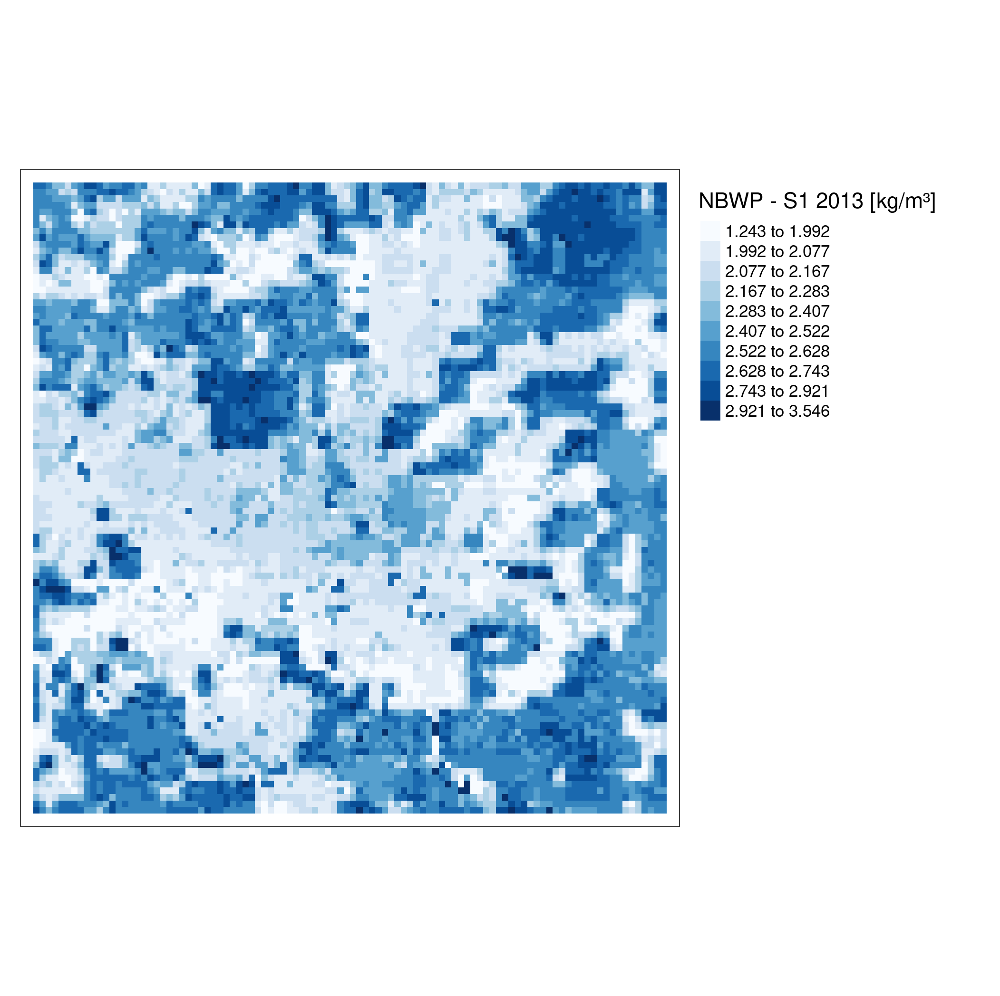

# mapme.agriculture  

<!-- badges: start -->

<!-- badges: end -->

## About MAPME

[MAPME](https://mapme-initiative.org/) is an initiative by [KfW](https://www.kfw.de/), 
[MapTailor Geospatial Consulting](https://maptailor.net/), and [Agence Française de Développement](https://www.afd.fr/) 
to provide free and open access to GIS tools and Earth observation 
in international development cooperation. MAPME is a community-driven initiative 
to jointly develop tools and solutions that help us to plan, monitor and evaluate 
our projects with the help of earth observation and Geographical Information Systems
(GIS). MAPME repositories contain R codes that will allow you to generate various 
statistics on land use / land cover and vegetation trends to gain insights in your 
project area – these methods can – for example – be used to assess outcome indicators #
or to monitoring the progress in your projects. At the time being, the MAPME repositories 
encompass three main functionalities:	

-  Analyze, maps and quantify land use / land cover (LULC), such as change in forest cover or cropland via the <code> {[mapme.forest](https://mapme-initiative.github.io/mapme.forest/)}</code> and {[mapme.classification](https://mapme-initiative.github.io/mapme.classification/)}</code>packages.

-  vegetation productivity change and trend assessments, e.g. to map landscape degradation or rehabilitation via {[mapme.vegetation](https://mapme-initiative.github.io/mapme.vegetation/)}</code> package

- Assessing agricultural productivity through the FAO WaPOR platform via this package

## About this package

`mapme.agriculture` is a R package that supports users to query, download and 
process data from the [FAO WaPOR API](https://wapor.apps.fao.org/home/WAPOR_2/1).
The data provided by FAO covers the African continent and the Middle East. It can 
be used to assess agricultural productivity and water consumption by crops or other plants.
The package helps to quickly query and download the necessary data files to conduct an
analysis of agricultural productivity related to biomass production and the amount
of water used by crops and other vegetation types.
WaPOR data is available at different spatial resolutions (30, 100m, 250m) for the 
complete African continent starting from the year 2009. While there exist finer 
resolution data for some selected locations, it is the 100 meter product that is 
of primary importance for the `{mapme.agriculture}` package. Its primary function 
is to calculate the net biomass water productivity, that is the amount of water 
that is used by crops and plants to produce biomass. Based on this parameter as 
well as others, several indicators about the productivity are calculated on a pixel
basis. This allows for a pixel-wise trend calculation as well as a comparison between 
epochs, e.g. in pre-post analysis of project interventions. 

## Ressources

The tutorial for the usage of the 
<code>{[mapme.agriculture](https://github.com/mapme-initiative/mapme.agriculture)}</code>
can be found 
[here](https://mapme-initiative.github.io/mapme.agriculture). Please visit
this page in order to get to know the API of `{mapme.agriculture}`.
